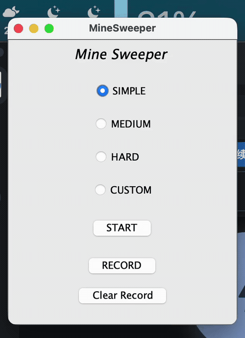
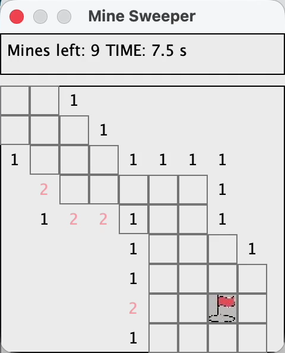

# MineSweeper

一个支持多种难度、自定义棋盘、递归展开、标记、计时和历史记录的 Java 桌面扫雷游戏。

[English](README.md)

## 项目概述

项目实现经典扫雷循环，并体现其网格算法：随机布雷、相邻数字计算、空白区域递归展开、旗标管理、胜负状态和本地历史记录。

## 演示



[查看高清 MP4 演示](assets/visual-demos/minesweeper-reveal-and-flag.mp4)

视频直接录制自原生 Swing 应用，展示难度选择、自定义棋盘、历史记录、旗标、计时、数字线索和递归展开。

## 截图



## 功能

- 简单、中等、困难与自定义配置
- 随机地雷与数字生成
- 空白区域递归展开
- 旗标/辅助点击交互
- 剩余地雷数与计时
- 序列化历史记录

## 运行

仓库中的 JAR 已在 Java 25 上验证：

```bash
java -jar MineSweeper.jar
```

## 数据说明

应用可能读写 `HISTORY`。录制和测试时应使用一次性工作目录。
